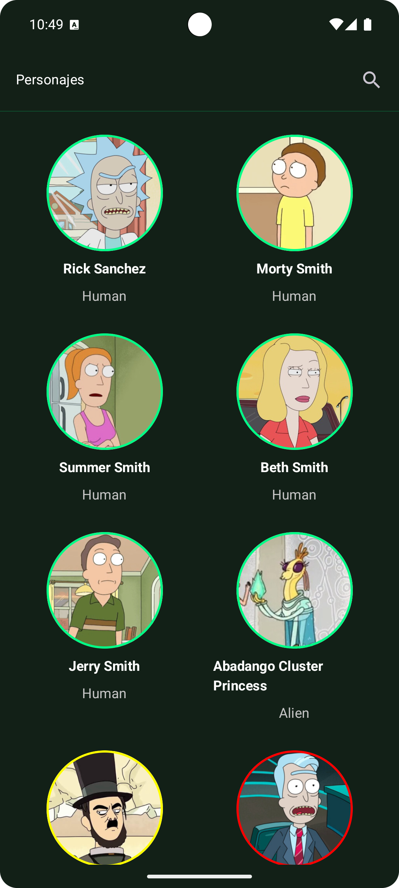
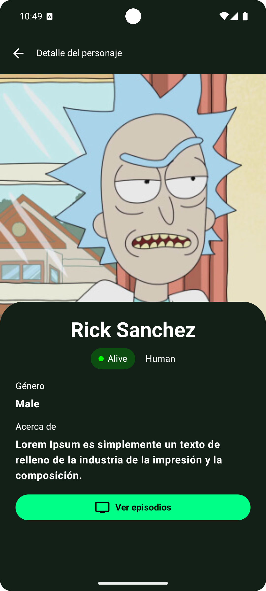
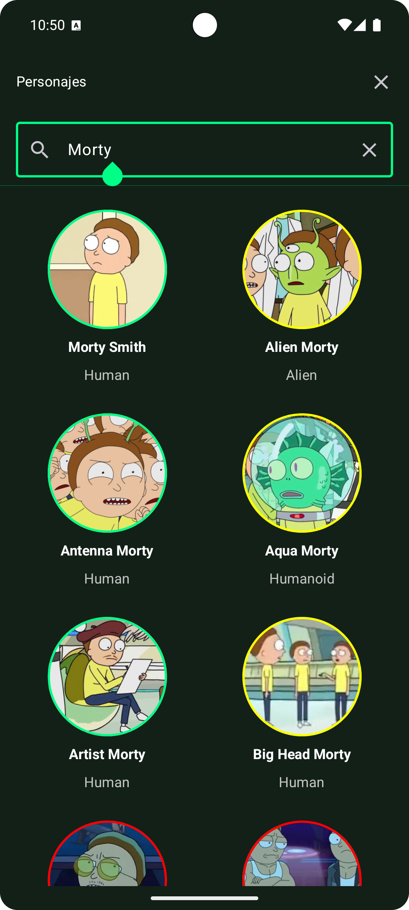

# Rick & Morty App

Poryecto basado en la API de Rick and Morty, implementando buenas prácticas de arquitectura y manejo de datos.

📸 Capturas de Pantalla

    

🛠️ Tecnologías y Arquitectura

Patrón de diseño: Clean Architecture + MVVM

Gestor de dependencias: Hilt

Abstracción de navegación: Routers

Testing unitario: Se añadieron pruebas unitarias a la lógica principal de dominio, viewModels, data

Localización de textos: Soporte multi-idioma mediante strings.xml

Cache: Implementado mediante mapas en memoria

Gestión de asincronía: Coroutines / Flow

Prefetching: Uso de Paging 3

❌ No utilizado en esta prueba

Room

Remote Mediator

📌 Notas

El cacheo se resolvió con Mapas en memoria, sin necesidad de persistencia en base de datos local.
